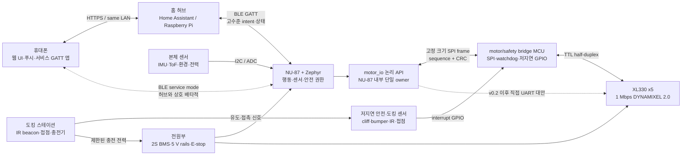
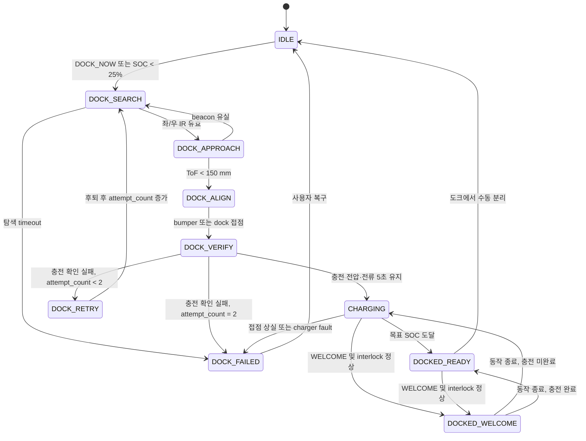

# microWallaby v0 시스템 아키텍처

- 상태: v0 구현 기준선
- 작성일: 2026-09-06
- 목표 릴리스: 2026-11-30
- 개발 인원: 2명
- 입력 요구사항: 로컬 비공개 `.docs/req-00-specification.md`
- 추적 작업: [`[M0] microWallaby v0 범위와 시스템 구조 확정`](https://github.com/mzsz94/micro-wallaby/issues/1)

## 1. 문서 목적

이 문서는 microDuck의 제어 원칙을 NU-87과 Zephyr에 맞게 축소하여, 2명이
2026년 11월 말까지 구현할 수 있는 microWallaby v0의 제품 범위와 시스템
경계를 고정한다.

여기서 "확정"은 모든 부품 번호와 회로가 동결되었다는 의미가 아니다. 제품
형태, 컴포넌트 책임, 안전 권한, 인터페이스, 성능 예산 및 기술 검증을 실패했을
때의 대체 경로가 결정되었다는 의미다. 센서의 세부 부품과 기구 치수는 이
기준선 안에서 후속 작업으로 조정할 수 있다.

## 2. 결정 요약

| ID | 결정 | 근거 | 재검토 조건 |
| --- | --- | --- | --- |
| AD-01 | v0는 2WD 바퀴형 소셜 센서 로봇으로 만든다. | 이족보행, 자율 도킹, 환경 알림을 2명·12주 안에 동시에 구현할 수 없다. | 이족보행을 필수 제품 요구사항으로 승격할 때 |
| AD-02 | microDuck의 외형과 표현성은 머리 yaw/pitch와 허리 yaw로 계승한다. | 환영 동작에 필요한 표현성을 유지하면서 낙상과 전력 위험을 줄인다. | 사용자 실험에서 표현력이 부족할 때 |
| AD-03 | NU-87/Zephyr가 로봇 상태와 안전의 최종 권한을 가진다. | 네트워크나 홈 허브 고장이 모터 안전을 침해하면 안 된다. | 변경하지 않음 |
| AD-04 | 도착 감지, 예약, 웹 UI와 휴대폰 알림은 상시 홈 허브가 담당한다. | NU-87의 자원과 무선 드라이버 위험을 줄이고 웹·알림 구현을 단순화한다. | NU-87 Wi-Fi/BLE가 장시간 검증되고 홈 허브 제거가 제품 요구가 될 때 |
| AD-05 | 도킹은 현관과 같은 공간, 도크 가시거리 2 m 이내의 유도식 방식으로 제한한다. | 집 전체 SLAM은 카메라/LiDAR, SBC와 더 긴 일정이 필요하다. | v1에서 자유주행을 추가할 때 |
| AD-06 | DYNAMIXEL port는 선택된 backend 하나만 소유하며 v0에서는 bridge firmware가 유일한 owner다. | microDuck의 단일 버스 소유자 원칙을 유지해 충돌과 비결정성을 막는다. | 변경하지 않음 |
| AD-07 | 외부 motor/safety bridge MCU를 v0 기본안으로 사용하고, NU-87 직접 1 Mbps UART는 병렬 spike로만 검증한다. | NU-87용 일반 고속 UART Zephyr 드라이버가 없고 저지연 안전 GPIO도 함께 수용해야 한다. | 직접 UART와 NU-87 안전 GPIO가 모두 24시간 시험을 통과한 뒤 BOM 절감이 필요할 때 |
| AD-08 | 카메라, SLAM, 음성 처리와 ML 보행 정책은 v0에서 제외한다. | Linux 미디어 스택과 큰 추론 런타임은 NU-87 자원 및 일정에 맞지 않는다. | SBC를 추가하는 v1 착수 시 |
| AD-09 | 제품의 모든 MCU firmware는 Zephyr로 구현하고, 필요한 upstream 기능이 없으면 local patch와 검증을 만든 뒤 Zephyr에 기여한다. | 한 RTOS의 build·test·driver 모델을 유지하고 프로젝트 결과를 재사용 가능하게 만들기 위함이다. | 변경하지 않음 |

### 2.1 선택에 사용한 기준

권장 기본안은 특정 부품을 선호해서 정한 것이 아니라, 다음 제약을 동시에
만족하는 조합을 찾은 결과다.

1. 입력 요구사항의 세 가지 사용자 가치인 `환영`, `자동 충전`, `집 상태
   알림`을 모두 시연할 수 있어야 한다.
2. 2명이 약 12주 안에 기구, 전원, 펌웨어, 허브와 시험을 끝낼 수 있어야 한다.
3. 통신이나 홈 허브가 고장 나도 로봇이 로컬에서 안전하게 멈춰야 한다.
4. NU-87과 Zephyr의 현재 지원 범위를 넘는 부분은 명시적인 기술 게이트와
   대체 경로를 가져야 한다.
5. microDuck을 그대로 복제하기보다 단일 actuator owner, 50 Hz 제어,
   non-blocking 제어 경로와 표현성이라는 유용한 원칙을 계승해야 한다.

평가 우선순위는 안전과 일정 가능성, 세 시나리오 충족, 하드웨어 단순성,
확장성 순서다. 따라서 기능이 더 많더라도 11월까지 반복 시험할 수 없는
대안은 v0에서 선택하지 않았다.

### 2.2 왜 이족 대신 2WD + 표현 관절인가

| 대안 | 장점 | v0에서의 문제 | 판단 |
| --- | --- | --- | --- |
| microDuck형 15관절 이족 | 원본과 가장 유사하고 표현력이 높음 | gait 개발·튜닝, 낙상, 15개 서보 전력, 도킹 정렬을 동시에 해결해야 함 | v1 이후 |
| 2WD + 표현 관절 3축 | 안정적인 이동, 제자리 회전, 반복 가능한 도킹, 머리·허리 환영 동작 가능 | 원본의 보행 동작은 재현하지 못함 | **v0 선택** |
| 고정형 센서 장치 | 가장 빠르고 안전하게 환경 알림 구현 가능 | 이동과 자동 도킹 요구사항을 충족하지 못함 | 제외 |

자동 도킹은 작은 위치 오차를 여러 번 보정해야 하므로 넘어질 수 있는 이족보다
차동 구동이 훨씬 반복 가능하다. 반면 환영 시나리오는 걷기 자체가 아니라
사용자가 생명감과 반응을 느끼는 것이 목적이다. 머리 yaw/pitch와 허리 yaw는
정지한 상태에서도 시선, 끄덕임과 몸 흔들기를 표현할 수 있다. 이 때문에
좌·우 바퀴 2개와 표현 관절 3개의 총 5축을 선택했다.

microDuck도 한 개의 1 Mbps Dynamixel bus에서 15개 actuator를 50 Hz로
제어하고, 최신 설계에는 wheeled policy mode가 남아 있다. v0는 같은
XL330 계열과 버스 제어 원칙을 유지하되 actuator 수를 5개로 줄여 전원,
통신 및 기구 위험을 낮춘다.

이 선택의 결과로 v0는 "걷는 microDuck 복제품"이 아니라 "microDuck의
표현 원칙을 가진 현관용 소셜 센서 로봇"이 된다. 이족보행이 제품 정체성에
필수라면 자율 도킹을 v0에서 빼고 별도의 locomotion 프로젝트로 다시
계획해야 한다.

### 2.3 왜 NU-87 단독이 아니라 홈 허브를 사용하는가

| 대안 | 장점 | v0에서의 문제 | 판단 |
| --- | --- | --- | --- |
| NU-87 단독 | 부품 수와 설치 과정이 적음 | 사용자 geofence, 예약, 웹 인증, 장기 이력과 휴대폰 push까지 MCU가 담당해야 함 | 기술 검증용만 |
| 온보드 Linux SBC + NU-87 | 카메라, 복잡한 웹과 로컬 AI 확장이 쉬움 | 전력·부피·부팅 시간과 Linux 운영 범위가 크게 증가 | v1 확장 |
| 기존 홈 허브 + NU-87 | 실시간 제어와 사용자 서비스를 분리하고 기존 알림·인증 활용 가능 | 상시 켜진 허브가 필요함 | **v0 선택** |

"사용자가 집 앞에 도착했다"는 사실은 로봇의 IMU나 거리 센서만으로 알 수
없다. 카메라로 사용자를 식별하려면 카메라, 조명 대응, 개인정보 처리와
추론 컴퓨팅이 추가된다. 홈 허브는 휴대폰 geofence와 현관 문 센서를 함께
사용해 이 이벤트를 더 적은 로봇 하드웨어로 만들 수 있다.

웹 UI, 예약과 휴대폰 알림도 실시간 모터 제어와 성격이 다르다. 이를 허브로
옮기면 NU-87은 안전·행동·센서의 bounded workload에 집중하고, 장기 이력과
사용자 인증은 검증된 웹 환경에서 처리할 수 있다. 허브가 꺼져도 로봇의
E-stop, 저전압, 충돌 및 통신 timeout은 계속 동작한다.

NU-87 공식 계열 보드의 Zephyr target은 464 KiB RAM을 제공하지만 Wi-Fi와
Bluetooth는 Realtek binary blob을 요구하며, NU-87 전용 board port도 아직
upstream 검토 중이다. 따라서 v0의 필수 사용자 경로는 BLE 하나로 제한하고
NU-87 직접 Wi-Fi, 웹 서버와 cloud push를 동시에 필수화하지 않았다.

### 2.4 왜 motor/safety bridge를 기본안으로 두는가

| 대안 | 장점 | v0에서의 문제 | 판단 |
| --- | --- | --- | --- |
| NU-87 직접 UART/GPIO | 보드와 펌웨어가 하나 줄어듦 | 일반 HS UART Zephyr driver, 정확한 half-duplex turnaround와 8개 저지연 GPIO 배치를 새로 검증해야 함 | 병렬 spike |
| 외부 motor/safety bridge | 검증된 UART를 고를 수 있고 watchdog과 안전 입력을 독립 처리 | MCU, SPI protocol과 firmware가 추가됨 | **v0 선택** |

NU-87의 PB18/PB19에서 1 Mbps half-duplex UART를 직접 구현하면 BOM을 줄일
수 있다. 그러나 현재 RTL872xD Zephyr 지원에는 일반 HS UART driver가 없고,
microDuck bus 코드는 Linux serial API에 의존하므로 그대로 사용할 수 없다.
cliff, bumper, dock IR와 접점까지 NU-87에 직접 붙이면 핀 mux와 interrupt
latency도 동시에 새로 검증해야 한다.

따라서 v0 기준선은 PB18~PB21 SPI로 연결한 Zephyr 기반 외부 bridge가 DYNAMIXEL bus,
cliff·bumper·dock 입력과 heartbeat torque-off를 담당하는 구성이다. NU-87은
고정 크기 command/state frame만 교환하며 behavior, safety 판정과 로봇 상태의
최종 권한을 계속 소유한다. bridge 자체도 heartbeat가 끊기면 독립적으로
모터를 끄므로 NU-87 software 고장에 대한 두 번째 방어선이 된다.

NU-87 직접 UART는 W2의 time-boxed spike로 남긴다. 직접 경로가 5개 XL330,
1 Mbps, 50 Hz, 안전 GPIO와 24시간 시험을 모두 통과해도 v0 도중 자동으로
교체하지 않는다. BOM 절감 가치가 검증 비용보다 클 때 별도 결정 기록을 남겨
v0.2 이후에 채택한다. 상위 `motor_io` API는 두 backend에서 같으므로 이
실험이 behavior와 safety 개발을 막지 않는다.

### 2.5 왜 SLAM 대신 IR + ToF + 기계식 funnel인가

| 대안 | 필요한 자원 | 특성 | 판단 |
| --- | --- | --- | --- |
| 카메라/LiDAR SLAM | SBC, perception stack, 지도와 localization 시험 | 집 전체 자유주행 가능, 일정·전력·안전 부담 큼 | v1 이후 |
| 바닥 유도선 | reflectance sensor와 바닥 marker | 구현은 가장 단순하지만 집 바닥 변경 필요 | 시험용 대안 |
| IR beacon + ToF + funnel | 저속 회전, 소수 센서, 수동 기구 공차 | 같은 방에서 저비용·저연산으로 반복 가능 | **v0 선택** |

v0의 핵심 가치는 "집 어디서나 도크를 찾는다"가 아니라 "정해진 현관
공간에서 예약 시각에 스스로 충전을 시작한다"이다. IR 좌·우 세기 차는
도크 방향을 제공하고, ToF는 최종 접근 속도를 낮추며, 기계식 funnel은
소프트웨어가 제거하기 어려운 수 센티미터의 정렬 오차를 흡수한다.

이 선택은 도킹 환경을 clear LOS 2 m와 초기 방위 ±90°로 제한한다. 그 대신
30회 반복 시험이라는 측정 가능한 성공 기준을 둘 수 있고, 실패를 SLAM 기능
추가가 아니라 beacon 배치, 접근 속도와 funnel 공차 조정으로 해결할 수 있다.

### 2.6 왜 센서를 이 조합으로 제한했는가

요구사항의 "지원 가능한 센서를 최대한 활용"을 그대로 적용하면 센서 수가
성공 지표가 되고, 각 센서의 calibration, driver, 전력과 오탐 처리 때문에
일정이 확장된다. v0는 센서마다 사용자 시나리오 또는 안전 기능 하나를
직접 연결하는 방식으로 바꿨다.

| 센서 | 선택 이유 | 이 센서가 없을 때 잃는 기능 |
| --- | --- | --- |
| IMU | 기울어짐과 충돌 후 비정상 자세 판단 | tilt 기반 torque-off |
| 전방 ToF | 저속 접근 거리와 장애물 정지 판단 | 안전한 최종 도킹 접근 |
| cliff IR 3개 | 계단·단차 접근을 바퀴 가까이에서 검출 | 낭떠러지 전 정지 |
| bumper 2개 | 광학 센서가 놓친 실제 접촉을 독립 검출 | 접촉 기반 최후 정지선 |
| dock IR 좌·우 | 지도 없이 도크 방향 오차 생성 | 자율 homing |
| 전압·전류·NTC | 저전압, stall, 충전 이상 판단 | 전원 기반 안전 정책 |
| 온습도 + 로봇 전원/fault | 별도 고비용 센서 없이도 집 상태와 로봇 이상을 알리는 P0 최소 조합 | 세 번째 사용자 시나리오의 기준선 |
| VOC·조도 | 공기질 추세와 방 상태의 맥락을 늘리는 P1 확장 | 일정 여유가 있을 때 알림의 설명력 향상 |

8×8 depth sensor, camera와 microphone은 흥미로운 데이터는 만들지만 v0의
세 시나리오에 필수적이지 않고 firmware, RAM 또는 개인정보 범위를 크게
늘리므로 제외했다. true CO2는 유용하지만 상대적으로 크고 비싸며 warm-up과
소비전력을 추가하므로 P2 stretch로 두었다.

### 2.7 왜 2S 배터리와 regulated 5 V rail인가

XL330-M288의 공식 입력 범위는 3.7~6.0 V이고 권장 전압은 5.0 V다. 5 V에서
한 개의 stall current는 1.47 A이므로 5개가 동시에 stall하면 이론상
7.35 A다. 이 값에 regulator transient와 배선 여유를 더해 actuator rail을
5 V, 10 A로 정했다.

- 1S pack은 전압은 안전하지만 5 V 고전류 boost에서 입력 전류와 손실이
  커지고 배선 부담이 증가한다.
- raw 2S는 충전 직후 8.4 V이므로 XL330의 6.0 V 상한을 넘어서 사용할 수 없다.
- 2S pack + 5 V buck은 배터리 전류를 낮추면서 motor 전압을 규정 범위에
  유지한다.

3 Ah는 약 22 Wh로, 1.5 kg 이하 기구에서 혼합 동작 1.5~2시간이라는 초기
목표를 시험할 수 있는 출발점이다. 이는 계산상 보증값이 아니라 M1에서 실제
주행, 대기와 stall 전류를 측정해 조정할 설계 기준이다. 셀 충전 안전은
프로젝트에서 새로 설계하지 않고 보호회로가 있는 pack과 검증된 CC/CV
charger/power-path를 사용한다.

### 2.8 왜 50 Hz 제어와 100 Hz 빠른 센서 주기인가

microDuck은 15개 servo와 IMU를 단일 1 Mbps bus에서 읽고 쓰는 50 Hz
제어 루프를 사용한다. microWallaby는 actuator가 5개뿐이고 실내 속도를
0.15 m/s로 제한하므로 20 ms마다 갱신하는 50 Hz loop가 행동과 모터 명령에
충분하면서 BLE, 센서와 Zephyr kernel에 실행 여유를 남긴다.

bumper, cliff와 IMU는 충돌 직전의 변화를 더 빨리 포착해야 하므로 100 Hz로
sampling한다. `safety_ctrl`은 매 20 ms tick에서 최신 snapshot을 사용하고,
하드웨어 E-stop과 motor watchdog은 이 software loop보다 독립적이고 빠른
최후 방어선을 제공한다. 주기를 더 높이는 것은 실측 WCET와 bus 여유가
확인된 뒤에만 허용하며, 높은 숫자 자체를 성능 목표로 삼지 않는다.

### 2.9 선택으로 인해 사용자가 받아들이는 제약

- 로봇은 현관 공간 밖이나 도크가 보이지 않는 방에서 스스로 복귀하지 못한다.
- 홈 허브가 꺼지면 귀가 이벤트, 예약과 휴대폰 알림은 동작하지 않지만 로컬
  안전과 낮은 배터리 정지는 계속 동작한다.
- v0는 특정 얼굴을 인식하지 않는다. "사용자"의 의미는 홈 허브가 전달한
  인증된 도착 이벤트다.
- 환경 센서는 생활 정보와 추세를 제공하며 인증된 화재·가스 경보기가 아니다.
- v0 BOM에는 motor/safety bridge MCU가 포함된다. 이를 제거하는 직접 UART는
  별도 24시간 검증과 decision record 없이는 채택하지 않는다.
- 기구는 microDuck의 인상과 움직임을 참고하지만 이족 실루엣과 보행을
  동일하게 복제하지 않는다.

이 제약 중 하나를 제거하려면 단순한 구현 변경이 아니라 제품 범위 변경으로
취급한다. 이 경우 일정, 전원, 컴퓨팅 보드와 안전 시험을 함께 다시 산정한다.

### 2.10 왜 전용 BLE 앱 대신 웹 UI + 서비스용 BLE 앱인가

| 대안 | 사용자 경험 | 일정 영향 | 판단 |
| --- | --- | --- | --- |
| iOS·Android 전용 앱 | 가장 자연스러운 BLE 설정과 제어 | 두 플랫폼 배포·권한·업데이트까지 별도 제품이 됨 | v1 이후 |
| Web Bluetooth 중심 | 설치가 적음 | 플랫폼·브라우저별 지원 차이 때문에 필수 경로로 삼기 어려움 | 제외 |
| 반응형 웹 + 범용 GATT 앱 | 일상 기능은 어느 휴대폰에서나 웹으로 사용, 현장 진단은 기존 앱 활용 | 서비스 화면은 소비자용으로 다듬어지지 않음 | **v0 선택** |

일상 사용자는 홈 허브의 반응형 웹 UI로 상태, 예약과 알림을 다룬다. 홈 허브가
정상 운용 시 유일하게 연결된 BLE central이다. 초기 설정과 현장 진단 때만 물리 service
버튼을 눌러 3분간 service mode를 열고, 홈 허브 연결을 끊은 뒤 iOS/Android의
범용 GATT client(예: nRF Connect)로 NU-87에 직접 연결한다. service mode는
상태 읽기, bonding, 센서 점검과 `STOP`만 허용하며 연속 속도 명령은 허용하지
않는다.

이 경계는 요구사항의 BLE 접근성과 웹 UI를 모두 시험하면서도, 2명이 로봇과
도킹 외에 네이티브 앱 두 개까지 동시에 유지하는 범위를 피한다. 전용 앱이
사용자 테스트에서 필수로 확인되면 v1에서 GATT schema를 그대로 사용해 만든다.

### 2.11 수치 기본안의 근거와 변경 조건

| 기본값 | 선택 근거 | 다시 정하는 조건 |
| --- | --- | --- |
| 바퀴 60 mm, track 150 mm | XL330 wheel mode와 1.5 kg 이하 기구에서 제자리 회전이 가능하고, 현관 통로 폭을 과도하게 차지하지 않는 시작점 | CAD에서 폭 190 mm 또는 정적 전도각 목표를 넘을 때 |
| 질량 1.5 kg 이하, 무게 중심 80 mm 이하 | 접촉 시 에너지와 전복 모멘트를 줄이고 3 Ah pack·5축을 수용하는 상한 | 완성 BOM 질량 또는 10° 경사 전도 시험이 실패할 때 |
| 최고 0.15 m/s, 가속도 0.3 m/s² | 100 ms 정지 반응에서 추가 이동을 약 15 mm로 제한하고 실내 표현 동작에 충분함 | 정지거리 30 mm 또는 wheel slip 기준을 넘을 때 더 낮춤 |
| 도킹 2 m, 초기 방위 ±90° | 지도 없이 좌·우 IR 차를 신뢰할 수 있는 제한 환경을 먼저 고정 | 30회 시험이 실패하면 범위를 넓히지 않고 beacon·funnel을 조정 |
| 환영 2초, 알림 10초 | 환영은 사용자가 멈춰 기다리지 않을 정도로 즉각적이어야 하고, push 알림에는 홈 LAN·휴대폰 지연 여유가 필요함 | 사용자 시험 p95 또는 홈 허브 실측이 목표를 지속 초과할 때 |
| 도킹 첫 시도 90%, 두 번 이내 95% | 30회 시험에서 첫 시도 27회 이상, 최종 29회 이상 성공해야 통합을 진행할 수 있는 prototype gate | 실패 유형이 안전과 관련되면 비율과 무관하게 출하 금지 |
| 제어 50 Hz, 빠른 센서 100 Hz | microDuck의 검증된 제어 cadence를 유지하면서 20 ms tick 사이에 안전 입력을 한 번 더 관측 | WCET·bus·정지거리 실측이 예산을 넘으면 주기와 구조를 함께 재설계 |

이 값은 제품 인증 수치가 아니라 v0 합격 여부를 같은 방식으로 판단하기 위한
engineering baseline이다. 변경할 때는 측정 로그와 함께 decision record를
남기며, 목표 달성을 쉽게 만들기 위해 시험 조건만 좁히지 않는다.

### 2.12 왜 Zephyr 미지원 기능을 직접 기여하는가

| 대안 | 장점 | 장기 비용 | 판단 |
| --- | --- | --- | --- |
| vendor SDK로 기능별 우회 | 초기 bring-up이 빠를 수 있음 | build, driver와 test 체계가 둘로 갈리고 Zephyr 앱과 통합하기 어려움 | 복구 도구 외에는 제외 |
| 영구 private fork | 일정 통제가 쉬움 | upstream 변화 추적과 재적용을 프로젝트가 계속 부담 | 임시 staging만 |
| upstream-first Zephyr 기여 | 리뷰와 병합 시간이 듦 | 공용 driver·board 지원과 test가 남고 유지 비용을 공유 | **v0 선택** |

v0에서 확인된 기여 후보는 NU-87 board DTS/pinctrl의 I2C·SPI·ADC·Bluetooth
enablement, AmebaD 일반 HS UART/half-duplex 지원, AmebaD `west flash` runner와
보드별 자동 시험이다. 이 중 v0 제품 build/runtime에 필요한 SPI·I2C·ADC·BLE와
board support는 **필수 기여 경로**, bridge 때문에 사용하지 않는 HS UART와
공식 복구 도구로 대체 가능한 `west flash`는 **비차단 기여 경로**로 구분한다.
필수 기능이 없거나 결함이 재현되면 다음 순서로 진행한다.

1. 고정한 upstream Zephyr revision에서 최소 재현 sample/test를 만든다.
2. application workaround가 아니라 SoC driver, board DTS/pinctrl 또는 runner의
   적절한 계층에 작은 patch를 만든다.
3. repository의 `patches/zephyr/` 또는 manifest fork에 commit을 고정해 v0 build를
   즉시 재현하고, 같은 변경을 Zephyr upstream PR로 제출한다.
4. upstream CI와 NU-87 hardware log를 PR에 첨부하고 review 수정도 local patch에
   동기화한다.

upstream merge 자체는 외부 일정이므로 v0 완료 조건이 아니다. v0 필수 경로는
최소 재현 test, 문서화된 local patch, upstream PR 제출과 고정 revision의 CI
통과를 완료 조건으로 삼는다. HS UART와 `west flash`는 각각 최대 3 engineer-day로
time-box하고, v0에서는 reproducer, 설계 메모와 upstream issue/초안 PR 중 가능한
산출물을 남긴 뒤 별도 기여 작업으로 계속한다. 이 둘의 PR 제출·병합은 제품
release를 막지 않는다. motor/safety bridge도 upstream Zephyr가 지원하는 MCU를
골라 동일한 west workspace와 test 체계에서 빌드하며 bare-metal 전용 firmware를
새로 만들지 않는다.

## 3. 제품 범위

### 3.1 포함 기능

1. 홈 허브가 사용자의 도착 이벤트를 전달하면 정지 상태에서 3~5초간 환영
   동작을 수행한다. 도크에 있으면 바퀴 torque를 끈 채 제한된 표현 관절만
   사용하는 `DOCKED_WELCOME` profile을 적용한다.
2. 지정 시각 또는 낮은 배터리 상태에서 같은 공간의 고정 도크로 복귀하고
   충전 시작을 확인한다.
3. P0로 온습도와 로봇 배터리/fault를 측정하고 설정 임계값을 넘으면 홈 허브를
   통해 휴대폰에 알린다. VOC 추세와 조도는 P1이며 W9 여유가 있을 때 추가한다.
4. 반응형 웹 UI에서 상태, 센서, 마지막 오류, 예약 시각을 확인하고
   `환영`, `도킹`, `정지` 명령을 보낸다.
5. 홈 허브가 BLE 운용 연결을 소유하고, 물리 service mode에서는 범용 휴대폰
   GATT 앱으로 초기 설정, 근거리 진단과 정지를 수행한다.
6. 통신 단절, 충돌, 낭떠러지, 과열, 저전압, 기울어짐 및 충전 이상을
   로컬에서 감지하고 안전 상태로 전환한다.

### 3.2 제외 기능

- 이족보행, 15관절 보행 및 강화학습 gait
- 집 전체 지도 작성, SLAM, 임의 위치에서의 자율 복귀
- 문턱, 계단, 두꺼운 카펫 및 욕실 주행
- 카메라, 얼굴·특정 사용자 시각 인식 및 WebRTC
- 음성 인식, 음성 비서 및 오디오 분류
- 자체 클라우드 백엔드와 iOS·Android 네이티브 앱 동시 개발
- NU-87에서의 ML 추론과 microDuck Linux daemon 직접 포팅
- OTA/rollback 및 원격 펌웨어 업데이트
- 화재, 가스 또는 CO 안전기기를 대체한다는 주장

### 3.3 운영 환경

- 실내 평탄 바닥, 건조한 공간만 지원한다.
- 도킹 시험 구역에는 계단, 문턱, 느슨한 케이블과 이동 장애물이 없어야 한다.
- 도크는 현관과 같은 공간에 설치하고 진입 경로 2 m를 확보한다.
- 로봇은 어린이·반려동물용 안전 인증 제품이 아니며 감독 가능한 프로토타입이다.

## 4. 사용자 시나리오와 합격 기준

| 시나리오 | v0 동작 | 합격 기준 |
| --- | --- | --- |
| 귀가 환영 | Home Assistant 등에서 geofence와 문 열림을 조합해 `WELCOME` intent를 전달한다. 로봇은 바닥 또는 도크에서 바퀴를 정지하고 머리와 허리를 흔든다. | 유효 이벤트부터 동작 시작까지 2초 이내, 바닥 25회+도크 25회 중 48회 이상 성공, 안전 fault 0회 |
| 예약 도킹 | 홈 허브가 `DOCK_NOW`를 전달하거나 로봇 SOC가 25% 미만이면 도킹을 시작한다. | clear LOS 2 m, 초기 방위 ±90°에서 첫 시도 90% 이상, 2회 이내 95% 이상, 30회 시험 |
| 집 상태 알림 | P0 온습도 임계값 또는 로봇 전원/fault를 홈 허브에 이벤트로 전달한다. | 이벤트 발생부터 휴대폰 알림까지 10초 이내, 30회 중 29회 이상, 중복 알림 억제 |
| 수동 정지 | 웹/BLE 정지 intent 또는 물리 E-stop을 사용한다. | 통신 정지는 250 ms 이내 명령 0, 물리 E-stop은 소프트웨어와 무관하게 액추에이터 전원 차단 |

특정 사용자 식별은 로봇이 하지 않는다. 홈 허브가 휴대폰 geofence나 기존
스마트홈 계정을 바탕으로 이벤트 의미를 결정하고 로봇에는 인증된 고수준
intent만 전달한다.

## 5. 시스템 컨텍스트



실선은 v0 기준선이고 점선 직접 UART는 동시에 장착하는 경로가 아니다.
`motor_io`는 NU-87 내부의 논리 API이며, v0에서는 SPI backend가 bridge와
통신한다. bridge firmware가 실제 DYNAMIXEL port를 유일하게 연다.

### 5.1 책임 경계

| 컴포넌트 | 소유하는 상태와 책임 | 소유하지 않는 것 |
| --- | --- | --- |
| NU-87/Zephyr | 로봇 상태, 안전 판정, 행동 상태기계, 센서 snapshot, BLE 연결, 설정과 오류 로그 | 사용자 위치, 웹 계정, 장기 센서 이력 |
| NU-87 `motor_io` | 단일 command/state API, 목표 제한, SPI sequence·freshness 검사 | DYNAMIXEL port 직접 소유(v0 기준선) |
| motor/safety bridge | DYNAMIXEL port 단독 소유, Sync Read/Write, 저지연 입력, bumper/cliff local wheel torque-off, heartbeat torque-off | 행동 전이, 예약, 웹 UI |
| 홈 허브 | 사용자 도착 이벤트, 예약, 웹 UI, 알림, 장기 이력과 사용자 인증 | 직접 모터 목표값 생성, 안전 제한 우회 |
| 휴대폰 | 사용자 입력과 상태 표시 | 로봇 제어 상태의 원본 |
| 도킹 스테이션 | IR 유도 신호, 기계적 정렬, 제한된 충전 전력 | 로봇 이동 제어 |

홈 허브와 휴대폰은 `속도 0.1 m/s` 같은 저수준 값을 지속 전송하지 않는다.
`WELCOME`, `DOCK_NOW`, `STOP` 같은 intent를 보내고 NU-87이 현재 상태와
안전 조건을 적용해 실행 여부를 결정한다.

## 6. 하드웨어 기준선

### 6.1 기구와 액추에이터

| 항목 | v0 목표 |
| --- | --- |
| 형태 | 좌우 구동 바퀴 2개 + 후방 ball caster |
| 표현 관절 | waist yaw, head yaw, head pitch |
| 액추에이터 | DYNAMIXEL XL330-M288 5개 |
| 제어 모드 | 바퀴 2개 velocity mode, 표현 관절 3개 position mode |
| 바퀴 | 지름 약 60 mm |
| wheel track | 약 150 mm |
| 크기 | 높이 220~260 mm, 폭 160~190 mm |
| 질량 | 배터리 포함 1.5 kg 이하 |
| 무게 중심 | 바닥에서 80 mm 이하 목표 |
| 최고 속도 | 0.15 m/s 이하 |
| 최고 가속도 | 0.3 m/s² 이하 |

XL330-M288는 5 V에서 velocity mode와 position mode를 제공하고, 권장
입력 전압이 5 V인 TTL half-duplex 장치다. 바퀴용 지속 부하와 기구 질량은
실측 온도와 전류를 기준으로 다시 제한한다.

### 6.2 센서

| 우선순위 | 용도 | 기준 부품 또는 등급 | 연결 위치 |
| --- | --- | --- | --- |
| P0 | 자세·충돌 판정 | 6축 IMU, BMI270/ICM-42688급 | NU-87 I2C |
| P0 | 전방 거리 | VL53L1X급 single-zone ToF 1개 | NU-87 I2C |
| P0 | 낭떠러지 | 하향 IR 3개(좌·중·우) | `motor_io` 안전 입력 |
| P0 | 충돌 | 전방 bumper switch 2개 | `motor_io` 안전 입력 |
| P0 | 도킹 방향 | 38 kHz IR beacon + 좌·우 receiver | `motor_io` 입력 |
| P0 | 도크 상태 | 접점 감지, 충전 전압·전류 | `motor_io` 및 전력 모니터 |
| P0 | 자체 전력 | INA226급 전압·전류, battery NTC | NU-87 I2C/ADC |
| P0 | 환경 기본 | 온습도(BME280/SHT4x급) | NU-87 I2C |
| P1 | 환경 확장 | VOC trend(SGP40급), 조도(VEML7700급) | NU-87 I2C |
| P2 | 환경 | true CO2(SCD41급) | v0 시간·전력 여유가 있을 때만 |

P0 알림은 온도·습도와 로봇 전원/fault를 포함한다. VOC와 조도는 P1이며
통합 일정이 밀리면 제거할 수 있다. VOC 센서는 추세 알림에만 사용한다.
연기, CO, 화재 또는 생명 안전 경보기의 대체물로 사용하거나 표시하지 않는다.

### 6.3 전원과 충전

- 배터리 기준선은 보호회로/BMS가 포함된 2S Li-ion, 7.4 V nominal,
  3 Ah(약 22 Wh)다.
- XL330에는 raw 2S를 연결하지 않는다. 5 V, 10 A synchronous buck을
  사용해 액추에이터 rail을 만든다. 5개 모터의 5 V stall current 합계는
  약 7.35 A이므로 배선, 커넥터와 보호소자도 이 전류를 견뎌야 한다.
- pack과 BMS는 배터리 6.0 V, buck 효율 85%라는 보수 조건에서 50 W 출력을
  공급할 수 있도록 연속 방전 12 A 이상, 1초 peak 20 A 이상을 구매 기준으로
  둔다. cell 자체의 방전 정격도 BMS보다 낮지 않아야 한다.
- actuator buck은 enclosure 40°C에서 5 V/10 A 연속, 1초 15 A peak를
  공급하고 current limit, over-temperature shutdown과 최소 15% 열 여유를
  가져야 한다. W3에서 전자부하와 실제 동작 파형으로 정격을 검증한다.
- NU-87과 센서는 별도의 clean 5 V, 1~2 A regulator에서 공급한다.
- 두 rail의 ground는 전원 입력의 한 점에서 결합하고, 액추에이터 rail에
  fuse/eFuse, 역극성 보호, TVS, bulk capacitor와 하드웨어 load switch를 둔다.
- 물리 E-stop은 MCU 상태와 관계없이 액추에이터 5 V load switch를 끈다.
  NU-87 전원은 유지하여 오류 원인을 보고한다.
- 도크는 12 V SELV 어댑터와 검증된 2S 8.4 V CC/CV charger/power-path
  모듈을 사용한다. 셀 충전 회로를 프로젝트에서 직접 설계하지 않는다.
- 도크에서 표현 관절을 움직일 때도 charger와 actuator 부하가 동시에 안전하게
  공급되도록 power-path 역류 차단과 adapter 전력 여유를 W3에서 확인한다.
- 도크 접점은 `+12 V`, `GND`, `dock sense` 3개를 기본으로 하며,
  recessed pad, pogo pin, 역삽입 방지 funnel과 접점 전류 제한을 둔다.
- 목표 사용 시간은 혼합 동작 1.5~2시간, 대기 8시간 이상, 1 A 충전
  3~4시간이다. M1 전력 측정 결과로 배터리를 최종 확정한다.

## 7. 도킹 설계

도킹은 지도 기반 내비게이션이 아니라 제한된 homing 상태기계다.



- 도킹을 시작할 때 `attempt_count=1`로 설정한다. `DOCK_VERIFY` 실패 후 한 번만
  후퇴·재탐색하며 두 번째 검증 실패 시 `DOCK_FAILED`가 된다.
- `DOCK_SEARCH`: 제자리 회전하며 좌·우 IR 세기 차를 줄인다.
- `DOCK_APPROACH`: 최대 0.08 m/s로 접근한다.
- `DOCK_ALIGN`: ToF 150 mm 이내에서 0.03 m/s 이하로 제한한다.
- funnel은 좌우 약 ±30 mm의 초기 오차를 기계적으로 흡수한다.
- bumper/contact가 감지되면 즉시 wheel command를 0으로 만든다.
- `DOCKED_WELCOME`에서는 접점이 5초 이상 안정적이고 tilt·전원·온도가 정상일
  때만 wheel torque를 끈 상태로 head/waist를 정격 전류의 30%, 진폭 ±15°,
  3초 이하로 움직인다. 접점 변화나 fault가 생기면 즉시 모든 torque를 끈다.
- SOC 25% 미만 도킹은 예약 시각보다 우선하며, SOC 15% 미만에서는
  이동을 금지하고 사용자의 수동 도킹을 요청한다.

## 8. Zephyr 소프트웨어 구조

### 8.1 실행 단위

| 실행 단위 | 주기/방식 | 우선순위 | 책임 |
| --- | --- | --- | --- |
| `safety_ctrl` | 50 Hz | 최고 | 최신 센서 snapshot과 목표 intent 검증, 정지 override, watchdog feed |
| `sensor_fast` | 100 Hz | 높음 | IMU, bumper, cliff, wheel/motor 상태 수집 |
| NU-87 `motor_io` | 50 Hz | 높음 | 단일 command/state queue, 목표 clamp, bridge SPI 교환과 freshness 검사 |
| bridge firmware | 100 Hz 내부 loop | NU-87와 독립 | DYNAMIXEL Sync Read/Write, 안전 GPIO latch, heartbeat torque-off |
| `behavior_sm` | 20 Hz | 중간 | IDLE, WELCOME, MANUAL, DOCKING, CHARGING, FAULT 상태 전이 |
| `dock_sm` | 20 Hz, `behavior_sm` 하위 | 중간 | IR/ToF 기반 SEARCH, APPROACH, ALIGN, VERIFY |
| `ble_transport` | event-driven | 중간 | 인증된 intent 수신, 상태·이벤트 publish, heartbeat |
| `environment` | 0.2~1 Hz | 낮음 | 환경 센서 sampling, hysteresis와 임계값 이벤트 생성 |
| `storage_health` | event/저주기 | 낮음 | NVS 설정·보정, 작은 ring log, health counter |

ISR과 driver callback은 동작을 결정하지 않는다. 고정 크기 `zbus` channel,
`k_msgq` 또는 last-value-wins snapshot으로 데이터를 전달한다. 제어 경로는
네트워크, flash 쓰기, 환경 센서 또는 홈 허브 응답을 기다리지 않는다.

### 8.2 상태 모델

```text
BOOT -> SAFE_IDLE -> READY
                    |-- WELCOME
                    |-- MANUAL
                    |-- DOCKING(DOCK_SEARCH -> DOCK_APPROACH -> DOCK_ALIGN
                    |             -> DOCK_VERIFY -> CHARGING/DOCKED_READY)
                    |-- DOCKED_WELCOME
                    `-- FAULT

어느 상태에서든 ESTOP은 모든 동작보다 우선한다.
```

상태의 단일 소유자는 NU-87의 `behavior_sm`이다. `safety_ctrl`은 상태기계와
독립적으로 모든 출력에 최종 clamp 또는 torque-off를 적용할 수 있다.

### 8.3 설정과 영속 상태

- NVS 저장: device identity, BLE bonding, 센서 보정, 모터 방향·영점·제한,
  알림 임계값과 마지막 fault code
- 홈 허브 저장: 예약, 사용자 계정, 장기 센서 이력, 알림 전송 상태
- 동작 중 flash 쓰기를 금지하고 `SAFE_IDLE` 또는 `CHARGING`에서만 반영한다.
- 부팅 시 설정 schema version과 CRC를 확인하고 실패하면 안전 기본값으로
  시작하며 모터를 활성화하지 않는다.

## 9. 인터페이스

### 9.1 홈 허브·서비스 앱 ↔ NU-87

BLE GATT를 v0 기준 transport로 사용한다. Wi-Fi 직접 연결은 NU-87 보드에서
검증된 뒤에만 stretch 기능으로 추가한다. NVS에는 LE Secure Connections bond를
두 개까지 저장해 `HUB` 1개와 `SERVICE` 1개의 peer role을 구분하지만, 동시
연결은 하나만 허용한다. 정상 운용에서는 `HUB`만 whitelist하고, 범용 휴대폰
GATT 앱은 물리 버튼으로 연 service mode에서 홈 허브 연결을 종료한 뒤에만
`SERVICE`로 접속할 수 있다.

| client | 사용 시점 | 허용 범위 |
| --- | --- | --- |
| 홈 허브 BLE central | 정상 운용 | 아래의 모든 고수준 intent, 설정, 상태와 telemetry |
| iOS/Android 범용 GATT 앱 | 3분 service mode | bonding, 상태·센서 읽기, 진단 실행, `STOP`; 이동·관절 연속 제어 금지 |
| 반응형 웹 UI | 정상 운용, Hub 경유 | 상태·예약·임계값·`WELCOME`·`DOCK_NOW`·`STOP` |

| 방향 | 메시지 | 규칙 |
| --- | --- | --- |
| Hub → Robot | `WELCOME`, `DOCK_NOW`, `STOP`, `CLEAR_FAULT` | 고수준 intent만 허용, sequence와 expiry 포함 |
| Hub → Robot | `SET_THRESHOLDS`, `SET_PROFILE` | version과 CRC 확인, 정지 상태에서만 적용 |
| Robot → Hub | `STATE`, `HEALTH`, `FAULT` | 상태 변화 즉시 + 1초 heartbeat |
| Robot → Hub | `SENSOR_EVENT` | hysteresis/debounce 적용, 중복 억제 key 포함 |
| Robot → Hub | `TELEMETRY` | 최대 1 Hz; 원시 IMU stream은 전송하지 않음 |

bond 생성과 role 지정은 물리 버튼을 5초 눌러 연 3분 provisioning window에서만
허용하고, 숫자 passkey를 사용하는 LE Secure Connections authenticated pairing을
요구한다. passkey는 device별로 생성해 본체 라벨과 설치 기록에 남긴다. 첫
암호화 연결이 one-byte `CLAIM_ROLE(HUB|SERVICE)` characteristic을 쓰면 빈 slot에
고정하고, 기존 role의 교체·삭제는 버튼을 10초 눌러 연 local reset window에서만
허용한다. NU-87은 bond의 peer role로 GATT 권한을 결정한다. 범용 앱에 별도
HMAC/token 입력을 요구하지 않으며, 암호화된 `SERVICE` 연결에는 read/diagnostic와
항상 안전을 강화하는 `STOP`만 허용한다. `HUB` 쓰기 명령은 sequence와 expiry도
확인한다. 연결이 끊기면 진행 중인 원격 수동 동작은 250 ms 안에 정지한다. 자율 도킹은 로컬
안전 센서가 정상일 때만 계속할 수 있고 연결 복구 후 상태를 재동기화한다.
service mode는 물리 버튼과 3분 timeout으로만 진입하고, 종료 시 홈 허브를
다시 유일한 central로 연결한다. v0에서 별도 네이티브 앱은 개발하지 않는다.

### 9.2 `motor_io` API와 배치 backend

`motor_io`는 NU-87 내부의 논리 API다. `safety_ctrl`과 `behavior_sm`은
`motor_command`를 제출하고 `motor_state` snapshot을 받을 뿐, UART나 SPI를
직접 열지 않는다.

| 계층 | v0 기준선 | 직접 UART spike |
| --- | --- | --- |
| NU-87 application | 동일한 `motor_io` API와 single-owner queue | 동일 |
| transport backend | PB18~PB21 SPI, bridge frame | PB19 TX/PB18 RX/PA15 enable 후보 |
| wire protocol | version, sequence, timestamp, length, CRC가 있는 고정 크기 frame | DYNAMIXEL Protocol 2.0 자체 |
| 실제 DYNAMIXEL port owner | bridge firmware | NU-87 `dxl_uart_backend` |
| 저지연 GPIO owner | bridge firmware | NU-87 interrupt GPIO; W2에서 별도 검증 필요 |

v0의 bridge는 bumper/cliff edge를 local fault로 latch하고 SPI나 NU-87 상태와
관계없이 100 ms 안에 wheel torque를 해제한다. 이 제한 동작은 NU-87이 해제할
수 없고, 물리 원인이 사라진 뒤 명시적인 `CLEAR_FAULT` handshake가 필요하다.
SPI heartbeat가 250 ms 끊기면 bridge가 독립적으로 wheel과 joint torque를
해제한다. direct spike에는 별도의 NU-87 watchdog 경로가 필요하다. 두 backend를
동시에 빌드하거나 한 DYNAMIXEL bus를 둘이 열 수 없도록 build-time choice로
제한한다.

### 9.3 DYNAMIXEL bus

- Protocol 2.0, 1 Mbps, 단일 TTL half-duplex multidrop bus
- 선택된 backend 하나만 port를 열고 Sync Read/Sync Write를 수행한다. v0에서는
  bridge firmware가 유일한 port owner다.
- wheel 2개는 velocity/current/temperature/voltage를, 표현 관절 3개는
  position/current/temperature/voltage를 읽는다.
- BUS Watchdog, current/PWM limit과 temperature shutdown을 장치에도 설정해
  소프트웨어 안전 계층과 독립된 방어선을 만든다.

## 10. NU-87 핀 및 주변장치 예산

아래 값은 현재 NU-87 보드 지원 PR과 공개 보드 자료를 기반으로 한 v0
할당안이다. 구매한 보드 revision의 schematic과 Zephyr pinctrl로 W1/M1에서
반드시 재확인한다.

| 기능 | 핀/주변장치 후보 | 제약 |
| --- | --- | --- |
| 환경·IMU·ToF I2C | PA26 SDA, PA25 SCL | native USB와 동시 사용하지 않음, 400 kHz, 3.3 V pull-up |
| motor/safety bridge | PB18 MOSI, PB19 MISO, PB20 CLK, PB21 CS | v0 기준선; HS UART, HS I2C, SDIO, I2S와 상호 배타적 |
| 직접 DYNAMIXEL spike | PB19 TX, PB18 RX, PA15 TX enable 후보 | bridge SPI와 상호 배타적; PA15 E-stop sense와 충돌하므로 대체 방향제어/감지 회로까지 해결해야 함 |
| 상태 RGB LED | PA13 red, PA12 green, PA14 blue | SPI TFT/I2S 확장과 충돌하므로 v0에서 TFT/I2S 제외 |
| USB-UART console/download | 보드 내장 USB-UART 전용 핀 | 개발·복구용으로 예약하고 런타임 센서에 재사용하지 않음 |
| battery/analog | PB1, PB2 ADC 후보 | 0~3.3 V 범위; divider와 ADC 실기 보정 필요 |
| service mode 버튼 | PB22 GPIO 후보 | 외부 3.3 V pull-up, 길게 누르기 debounce; Zephyr interrupt 실기 검증 필요 |
| bumper/cliff/IR/dock | bridge MCU interrupt GPIO | NU-87 I2C expander에는 시간 임계 입력을 두지 않음 |
| E-stop sense | PA15 NU-87 GPIO + bridge 입력 + 하드웨어 load switch | GPIO 두 개는 상태 보고용이며 전원 차단 자체를 담당하지 않음 |

PA7/PA8은 console/download, PA27/PA30은 boot strap, PB3은 SWD와 충돌하므로
v0에서 재사용하지 않는다. PB23/PB24 co-bonded pin과 PA28 native USB RREF도
기준선에서 제외한다. 모든 NU-87 입력은 3.3 V 이하로 제한하고 5 V sensor에는
level shifter, divider 또는 open-drain interface를 사용한다. native USB,
I2S audio, DMIC, QDEC와 대형 TFT는 v0 pin budget에 포함하지 않는다.

## 11. 시간 및 자원 예산

### 11.1 제어 시간

| 항목 | 목표 |
| --- | --- |
| safety/control deadline | 20 ms(50 Hz), 24시간 동안 deadline miss 0회 |
| 제어 계산 + 메시지 처리 | 한 tick의 50%인 10 ms 이하 |
| motor bridge 내부 loop | 최대 100 Hz |
| motor command timeout | 250 ms 이하 |
| bumper/cliff 정지 반응 | 감지 후 100 ms 이하 |
| BLE 재연결 | 전원 재인가 후 10초 이내 목표 |
| 부팅 | safe idle 10초 이내 |
| 웹 상태 갱신 | 정상 LAN에서 2초 이내 |

### 11.2 메모리와 flash

Zephyr의 RTL872xD 보드 문서는 464 KiB RAM과 4 MiB raw flash를 표시한다.
NU-87 보드 지원 PR에서 실제 application slot은 1,968 KiB로 정의되고 있어
raw flash 전체를 애플리케이션 예산으로 사용하면 안 된다.

| 자원 | v0 예산 |
| --- | --- |
| linked application image | 1.5 MiB 이하 |
| 전체 runtime RAM | 320 KiB 이하 |
| kernel·driver·BLE | 152 KiB 이하 목표 |
| thread stacks | 총 64 KiB 이하 |
| control·sensor state | 48 KiB 이하 |
| message/log buffers | 32 KiB 이하 |
| heap/transient | 24 KiB 이하; 부팅 후 동적 할당 금지 목표 |
| RAM headroom | 최소 128 KiB |

실제 map file과 `west build -t ram_report/rom_report` 결과가 이 예산을
대체한다. W1에서 blob, reserved region과 network buffer를 포함한 실제 사용
가능 SRAM을 확인하고, 128 KiB headroom을 확보하도록 320 KiB 상한을 더
낮춘다. 초과 시 Wi-Fi, CO2 센서, 상세 로그 순서로 제거하고 안전·제어 기능은
축소하지 않는다. 장기 센서 이력은 홈 허브에만 저장한다.

## 12. 안전 아키텍처

다음 규칙은 어떤 사용자 명령이나 네트워크 상태보다 우선한다.

1. 물리 E-stop은 액추에이터 rail을 직접 차단한다.
2. 도크 접점이 감지되면 wheel torque를 항상 비활성화한다. 표현 관절도
   기본적으로 끄며, `DOCKED_WELCOME`에서만 접점·tilt·전원·온도 interlock이
   정상일 때 30% current, ±15°, 3초 한도로 허용한다.
3. bumper 또는 cliff 감지 후 100 ms 안에 wheel command를 0으로 만든다.
   bridge가 이를 로컬에서 latch하고 torque-off하므로 SPI·NU-87 고장과 동시에
   발생해도 정지하며, 상위 명령은 이 latch를 우회할 수 없다.
4. cliff fault는 자동 재개하지 않고 사용자의 수동 복구를 요구한다.
5. IMU tilt가 35°를 200 ms 이상 넘으면 wheel과 joint torque를 해제한다.
6. XL330 온도는 60°C 경고, 65°C 출력 제한, 70°C torque-off로 처리한다.
7. SOC 25% 미만은 도킹을 우선하고, 15% 미만은 이동을 금지한다.
8. 충전 온도가 0~45°C 범위를 벗어나면 충전을 시작하지 않는다.
9. 명령 sequence, timestamp 또는 인증이 유효하지 않으면 실행하지 않는다.
10. sensor freshness가 허용 범위를 넘으면 관련 자율 동작을 중단한다.
11. watchdog reset 후 모터는 자동 활성화되지 않고 `SAFE_IDLE`에서 시작한다.
12. `DOCKED_WELCOME` 중 접점 변화, charger fault 또는 sensor stale이 생기면
    100 ms 안에 모든 관절 torque를 해제한다.

## 13. 빌드, 보드 지원 및 진단

- Zephyr commit과 west manifest를 고정한다.
- NU-87 전용 upstream PR이 병합되기 전에는 out-of-tree board 정의 또는
  검증한 PR commit을 저장소에서 명시적으로 고정하고 upstream review를
  따라가는 후속 PR을 제출한다.
- Realtek HAL이 요구하는 blob은 `west blobs fetch hal_realtek` 절차에
  포함하고 라이선스와 재배포 조건을 확인한다.
- 현재 AmebaD에는 `west flash` 지원이 없으므로 초기 v0는 공식 Windows
  AmebaImageTool을 복구 기준선으로 유지하면서, issue #115157을 재현하는
  runner/profile/test 기여를 3 engineer-day로 time-box한다. 기간 안에 PR 품질에
  도달하지 못하면 reproducer와 설계 메모를 issue에 남겨 후속 작업으로 계속한다.
  vendor tool은 firmware runtime이나 build 대체물이 아니다.
- NU-87 I2C·SPI·ADC·Bluetooth가 board target에서 동작하지 않으면 DTS/pinctrl,
  driver와 test를 Zephyr 방식으로 보완하고 upstream PR URL과 고정 commit을
  해당 Project 이슈의 산출물로 남긴다.
- bridge MCU는 Zephyr upstream에서 GPIO interrupt, SPI slave/controller,
  UART와 watchdog이 지원되는 장치를 선정하고 NU-87과 같은 west workspace에서
  별도 board target으로 빌드한다.
- PR CI는 clean build, compiler warning, 단위 테스트와 image/RAM budget을
  검사한다. 실기 시험은 별도 체크리스트와 로그 artifact로 남긴다.
- fault log는 고정 크기 ring으로 유지하며 reset reason, last state,
  sensor freshness, battery, motor error와 command sequence만 저장한다.
- 로그에 BLE key, Wi-Fi credential, 사용자 위치나 개인 식별 정보를 남기지 않는다.

## 14. 기술 게이트와 일정

| 시점 | 게이트 | 통과 조건 | 실패 시 조치 |
| --- | --- | --- | --- |
| W1 | NU-87 Zephyr bring-up | boot·console·GPIO·timer 100회 재현, 실제 usable SRAM/flash report와 128 KiB RAM headroom 확인 | 최소 재현 test와 local patch 작성, upstream PR 제출; 검증 commit 고정 |
| W2 | bridge + 1 Mbps motor bus | 5개 XL330, 50 Hz 24시간(4,320,000 tick), deadline miss·unrecovered transaction·의도치 않은 motion 0회, retry frame 0.01% 이하, 연속 missed tick 1회 이하 | SPI/UART timing·배선 수정 후 M1 통합 보류 |
| W2 | 직접 UART contribution spike | 최대 3 engineer-day 안에 일반 HS UART/half-duplex reproducer·driver test 작성; 구현 완료 시 24시간/9개 입력 기준 검증 | 결과와 upstream issue/초안 PR을 남기고 별도 기여로 계속; v0 제품은 Zephyr bridge 유지 |
| W2 | BLE | 24시간 reboot·memory exhaustion 0회, 100회 계획 재연결 중 99회 이상 10초 이내, 10,000개 명령에서 expired/duplicate 실행 0회, 1,000회 `STOP` 모두 250 ms 이하(p95 150 ms 이하) | DTS/driver/test local patch와 upstream PR; time-box 초과 시 Zephyr BLE coprocessor와 일정 재협의 |
| W3 | 전원 | enclosure 40°C, 5 V/10 A에서 온도 변화가 10분간 1°C 미만인 열평형까지 유지하고 buck 85°C 미만·brownout 0회; 15 A/1초 peak, E-stop/eFuse와 charger+표현 동작 검증 | rail·배선·regulator 재설계 후 기구 통합 보류 |
| W5 | 안전 주행 | bumper/cliff/tilt/timeout fault injection 통과 | 도킹 개발 전 안전 결함 우선 해결 |
| W7 | 도킹 | 2 m 제한 조건 30회 통계 충족 | funnel, IR와 접근 속도 조정; SLAM 추가 금지 |
| W9 | 홈 허브 | 도착·예약·웹·P0 알림 end-to-end 기준 충족 | P1 센서·비필수 시각화만 축소; P0 경로 실패 시 release 보류 |
| W11 | 통합 | 24시간 soak, 치명적 safety fault 0 | 기능 동결 후 결함만 수정 |
| W12 | v0.1 | 문서, BOM, 조립·복구·사용법, 필수 Zephyr patch의 고정 commit·CI·upstream PR 완성 | 미검증 기능을 release에서 제거 |

두 사람의 기본 분담은 다음과 같다.

- 담당 A: NU-87/Zephyr, BLE, 센서, behavior와 홈 허브 연동
- 담당 B: motor bus/bridge, 전원, 기구, 도크와 안전 시험

## 15. 요구사항 추적

| 입력 요구사항 | 아키텍처 대응 | 후속 검증 |
| --- | --- | --- |
| 사용자가 도착하면 환영 | 홈 허브 도착 event → BLE `WELCOME` → 표현 관절 동작 | M4 BLE, M5 사용자 흐름 |
| 지정 시간 자동 충전 | 홈 허브 schedule → 제한된 IR/ToF homing → 충전 확인 | M3 안전 범위, M5 고장 주입 |
| 집 상태 휴대폰 알림 | 환경 센서 → NU-87 threshold event → 홈 허브 push | M4 telemetry, M5 사용자 피드백 |
| BLE 앱·웹 UI | 홈 허브 BLE를 운용 경로로, 범용 GATT 앱을 service mode로, 반응형 웹을 일상 UI로 사용 | M4 단일 central·연결·인증 |
| 비상 정지·오류 대응 | 하드웨어 E-stop + `safety_ctrl` + motor watchdog | M1/M2 fault injection |
| Zephyr 사용·기여 | NU-87와 bridge를 Zephyr로 통일하고 필수 missing board/driver는 local patch 후 upstream PR, 선택 tooling은 time-boxed 기여 | M0/M1 고정 commit, CI, hardware log와 필수 PR URL |
| 2명·11월 말 | 이족/SLAM/카메라/음성/자체 cloud 제외, 기술 게이트 운영 | 모든 milestone exit criteria |

## 16. 남은 후속 결정

다음 항목은 시스템 경계를 바꾸지 않으므로 M0 종료를 막지 않는다.

- upstream Zephyr에서 필요한 GPIO·SPI·UART·watchdog이 지원되는 motor/safety
  bridge MCU와 보드 선정
- 구매 가능한 배터리 pack, charger와 5 V regulator 부품 번호
- IMU, 환경 센서와 dock IR 부품의 최종 BOM
- enclosure와 funnel의 CAD 및 접점 공차
- Home Assistant를 직접 사용할지 별도 경량 허브 서비스를 사용할지
- 알림 임계값과 사용자에게 보여줄 용어

초기 Project backlog에 남아 있는 `15축` 또는 `NU-87 단독 서비스` 가정은 이
문서의 5축·홈 허브 경계로 재기준화해야 한다. 해당 이슈의 구현 범위와 합격
기준은 착수 전에 이 문서를 기준으로 갱신한다.

## 17. 참고 자료

- [microDuck overall architecture](https://github.com/pollen-robotics/microduck/blob/main/docs/design/architecture.md)
- [microDuck robotd control-loop design](https://github.com/pollen-robotics/microduck/blob/main/docs/design/robotd-design.md)
- [NUCODE NU-87 module documentation](https://nucode.gitbook.io/nuseries/modules/nu-87.md)
- [NUCODE NU-87 TinyDK schematic downloads](https://nucode.gitbook.io/nuseries/downloads/nu-87-tinydk.md)
- [Zephyr RTL872xD evaluation board](https://docs.zephyrproject.org/latest/boards/realtek/rtl872xd_evb/doc/index.html)
- [Zephyr NU-87 board support PR #115156](https://github.com/zephyrproject-rtos/zephyr/pull/115156)
- [AmebaD west flash issue #115157](https://github.com/zephyrproject-rtos/zephyr/issues/115157)
- [ROBOTIS XL330-M288 e-Manual](https://emanual.robotis.com/docs/en/dxl/x/xl330-m288/)
- [NUCODE NU-87 product page](https://nuworks.io/product/Mg==)

## 18. M0 종료 조건

- [x] NU-87이 단독으로 소유할 실시간 제어·안전 범위와 홈 허브 및 미래 SBC
  확장 범위를 구분했다.
- [x] 50 Hz 안전·제어 구조와 단일 motor bus 소유자를 정의했다.
- [x] 주요 주변장치, 핀 충돌, 기본 motor/safety bridge와 직접 UART 대안을
  정의했다.
- [x] RAM, flash, 시간 및 전력 예산을 수치로 정의했다.
- [x] 사용자 시나리오를 측정 가능한 합격 기준으로 변환했다.
- [x] 카메라, SLAM, 고급 음성과 ML 정책을 v0에서 제외했다.
- [x] 안전 권한, fault 처리 및 후속 기술 게이트를 정의했다.
- [x] Zephyr 미지원 기능의 local patch, 검증 및 upstream 기여 원칙을 정의했다.

이 작업은 문서 기준선 확정이며 하드웨어를 변경하지 않았으므로 실기 시험
로그 조건은 해당 없음(N/A)이다. 하드웨어 실기 로그가 필요한 검증은 각 기술
게이트의 후속 이슈에서 수행한다.
